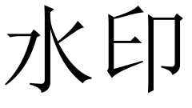

# 一、程序使用

## （一）语言和平台要求

本程序为Python程序，需要在已经安装了Python3和以下库的环境下运行：numpy, opencv-python, matplotlib。


## （二）参数解释
```
用法：python my_watermark.py <cmd> [arg...] [opts...]
  命令：
    encode <image> <watermark> <image(encoded)>
           图像 + 水印 -> 编码后的图像
    decode <image(encoded)> <watermark>
           编码后的图像 -> 水印
  选项：
    --seed <int>，手动设置随机种子（默认为2011266）
    --blocksize <int>，手动设置块大小（默认为8）
    --alpha <float>，手动设置alpha值（默认为3.0）
```

中文说明：

1. cmd：命令，可选值为"encode"、"decode"。
2. arg：参数，对于"encode"命令来说是输入图像地址、水印图像地址和输出图像地址，对于"decode"命令来说是输入图像地址和输出水印地址。
3. opts：可选选项，可以使用"--seed"、"--blocksize"、"--alpha"来手动设置随机种子、小方块的边长和嵌入水印时的参数。

## （三）示例一：给图像嵌入水印

<div>
    
    
</div>

以下指令将左图嵌入到右图中
```bash
python my_watermark.py encode image.jpg watermark.png image_wm.jpg --alpha 300 --blocksize 8 --seed 2011266
```
下图是嵌入结果


## （四）示例二：从（嵌入水印的）图像中提取水印
以下指令从（嵌入水印的）图像中提取水印
```bash
python my_watermark.py decode image_wm.jpg watermark_im.png --blocksize 8 --seed 2011266
```
下图是提取的水印


# 二、程序表现

## （一）乱涂乱画
下图是乱涂乱画图，以及对应的提取水印
<div>
    
    
</div>

## （二）裁剪

下图是裁剪图（黑色区域被裁），以及对应的提取水印
<div>
    
    
</div>


```python

```
